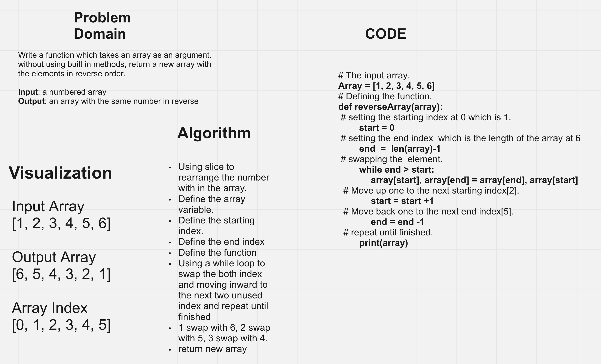
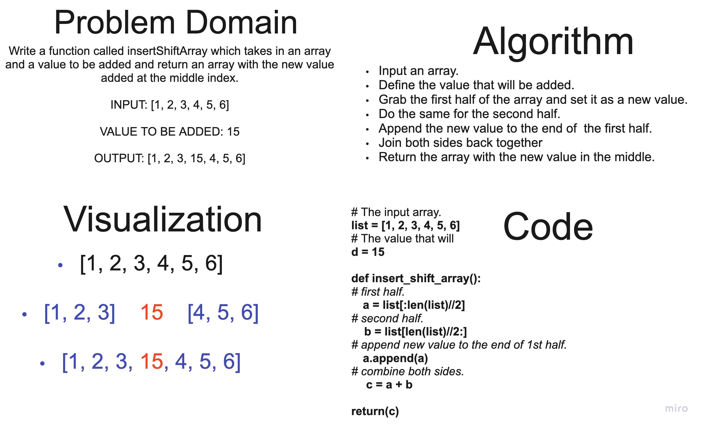

# Code Challenge

### Harvey Francois

### About
 The fallowing exercise are white board exercises. These exercises
 are ment to prepare for the white board interviews in the future.

### Code Challenge 1
Write a function called reverseArray, which takes an array as an argument.
without using built in methods, return a new array with
the elements in reverse order.

### Code Challenge 2
Write a function called insertShiftArray which takes in an array
and a value to be added and return an array with the new value
added at the middle index.

### Code Challenge 3
Write a function called BinarySearch which takes in
2 parameters: a sorted array and the search key. Without utilizing any of
the built-in methods available to your language, return the index of the
array’s element that is equal to the value of the search key, or -1 if the
element is not in the array.
